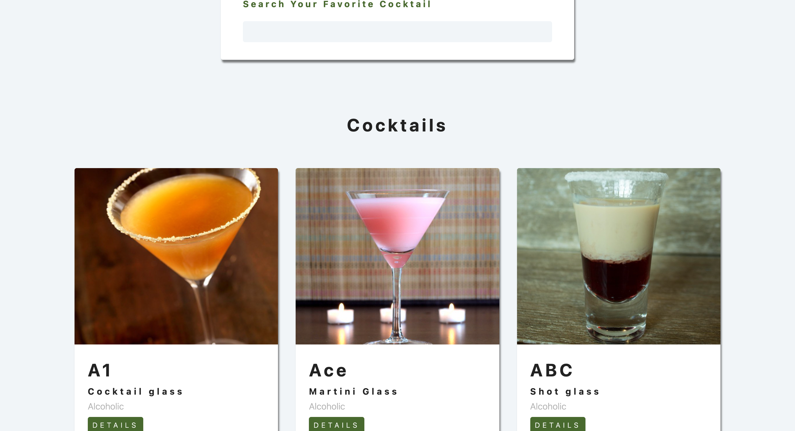

#### Filter product in React
The project is the development of a system that allows users to easily select products using an analogy with ingredients and cocktail recipes. Filtering is carried out based on the attributes of the goods and their compliance with the specified cocktails.

# Screen:

